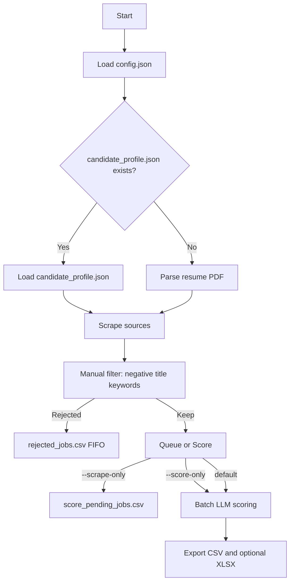

# Job Scraper - Automated Job Search and AI Rating

A Python-based job scraper that finds relevant job postings, rates them using AI, and exports results to CSV/Excel.

## Features

- Multi-source scraping: LinkedIn (public guest search), XING (Playwright show-more), Arbeitnow, company career pages
- AI scoring: Gemini / Groq / DeepSeek with batch requests and cooling
- Profile-driven scoring: `candidate_profile.json` (resume fallback optional)
- CSV/Excel output: description column included, color-coded Excel
- Scrape/score separation: queue scraped jobs and score later
- Scheduled scoring: time window + daily limits
- Manual guardrails: negative-title keyword skip + FIFO `rejected_jobs.csv`
- Grounded cover-letter queue with versioned evidence, retry-safe batches, and private/public separation
- Server-rendered job list with redacted guest samples and a password-protected application dashboard

## Requirements

- Python 3.10+
- API key from one of:
  - Groq
  - Gemini
  - DeepSeek

## Quick Start

### 1) Clone
```bash
git clone https://github.com/bharath1996-hub/Job-scrapper.git
cd Job-scrapper
```

### 2) Install
```bash
python -m venv venv
source venv/bin/activate  # Windows: venv\Scripts\activate
pip install -r requirements.txt
```

### 3) Configure
Edit `config.json` and `candidate_profile.json` (required for scoring).

### 4) (Optional) Add resume
If you remove `candidate_profile.json`, place a resume PDF in the project folder as fallback.

### 5) Run
```bash
python main.py --profile kk
```

## Flowchart



## Output

Primary outputs:
- `daily_jobs.csv` (matches)
- `daily_jobs_nonmatch.csv` (non-matches)
- `daily_jobs.xlsx` (if Excel output is enabled)

Queue:
- `score_pending_jobs.csv` (scraped jobs waiting to be scored)

Manual filter:
- `rejected_jobs.csv` (FIFO 100 rejected jobs)

Logs:
- `zero_results_log.csv` (sources that returned 0 jobs)
- `timeout_log.csv` (company page timeouts)
- `failed_requests_log.csv` (HTTP errors/non-200)
- `daily_summary_log.csv` (daily counts by source)
- `logs/screens/` (Playwright failure screenshots)

## Command Line Options

```bash
python main.py --profile kk                  # Full run with scoring
python main.py --profile kk --no-rate        # Skip AI rating
python main.py --profile kk --scrape-only    # Scrape and queue only
python main.py --profile kk --score-only     # Score pending jobs (scheduled mode)
python main.py --profile kk --score-only-manual  # Score pending jobs now (no limits)
python main.py --profile kk -o custom.csv    # Custom output file
```

## Cover Letters and Website

Matched jobs are automatically added to each profile's `cover_letters.db`. Every newly scored job meeting that profile's current match threshold is placed in a durable publication outbox and goes live on MatchAtlas immediately after that profile's scoring phase. Cover-letter generation is later enrichment; it never delays the public job link.

Run these commands from a valid WSL Python environment:

```bash
python3 cover_letters.py --profile kk sync-csv
python3 cover_letters.py --profile kk pull-cloud
python3 cover_letters.py --profile kk publish-pending
python3 cover_letters.py --profile kk prepare-batch --limit 40 --owner "$RUN_ID"
# Codex processes four chunks of at most ten and writes one result array per chunk
python3 cover_letters.py --profile kk commit-batch --input cover_letter_results.json --summary-output cover_letter_commit.json
python3 cover_letters.py --profile kk push-cloud --mode delta --job-ids-file cover_letter_commit.json
python3 cover_letters.py --profile kk push-cloud --mode full
```

Each profile claims at most 40 distinct post-cutover score-8-to-10 jobs once, ordered by newest discovery, score, and stable ID. One chunk commit uses one database session while isolating all ten items, so one invalid result cannot roll back the other nine. Generation targets 300–350 words and accepts 285–375 without repair. A real validation failure receives one repair attempt and does not consume another job slot.

The nightly coordinator owns one shared lease across KK and Sandra. It gates the start on the current five-hour allowance and prevents scheduled recovery checks or manual runs from duplicating claims:

```bash
RUN_ID="cover-letter-$(date +%s)"
python3 nightly_cover_letters.py start --owner "$RUN_ID" --remaining-percent 95
# exit code 75 means another generator is active; exit without changing the queue
python3 nightly_cover_letters.py continue --owner "$RUN_ID" --remaining-percent 80
python3 cover_letters.py --profile kk renew-claims --owner "$RUN_ID"
python3 nightly_cover_letters.py finish --owner "$RUN_ID" --status completed
```

Pass the same `RUN_ID` to both profiles' `prepare-batch --owner`. KK is always completed first. If the continuation gate closes, `release-claims` returns only that owner's unstarted items safely to the queue. A forced manual coordinator start bypasses usage thresholds only; it does not bypass profile isolation, eligibility, locking, or the 40-job cap.

To create an admin password hash, run `python3 cover_letter_web.py --hash-password`. Store the resulting hash and a long random session secret outside the repository, then start the local server:

```bash
export COVER_LETTER_ADMIN_PASSWORD_HASH='generated-hash'
export COVER_LETTER_SECRET_KEY='long-random-secret'
python3 cover_letter_web.py --host 127.0.0.1 --port 8765
```

Guest pages contain only the deterministic redacted letter body. Full letters, contact details, application state, and private notes are read only after server-side admin authentication. Public jobs and samples disappear after 28 days; applied-job history remains private.

The public home page includes a voluntary PayPal donation QR tile, and `/faq` explains the job sources, scores, cover-letter samples, privacy boundary, update schedule, and the project’s use of ChatGPT/Codex Cowork. The QR image is stored at `static/donation-qr.jpeg` and contains no application data.

### Secure cloud synchronization

The deployed website uses PostgreSQL while scraping, scoring, and letter generation remain local. Before pushing website data, synchronization downloads application status, private notes, and regeneration requests into the local SQLite database as a recovery copy.

```bash
export COVER_LETTER_SYNC_URL='https://your-service.onrender.com'
export COVER_LETTER_SYNC_TOKEN='same-secret-configured-on-render'
python3 cover_letters.py --profile kk pull-cloud
python3 cover_letters.py --profile kk push-cloud --mode delta --job-id JOB_ID
python3 cover_letters.py --profile kk push-cloud --mode full
```

`publish-pending` drains only newly scored jobs from the local profile outbox in bounded delta batches. A failed upload remains queued locally and is retried by the next weekday or cover-letter run; after three unsuccessful publication runs it becomes an actionable failure. Delta synchronization upserts only supplied jobs and does not run trend or retention work. One final full synchronization reconciles all retained jobs, updates the trend, applies retention, and acknowledges any outbox records it included. The `sync-cloud` command remains a backward-compatible alias for pull followed by full push. The server ignores uploaded public samples and derives redacted body text from validated full letters.

### Render and Supabase deployment

1. Create a Supabase Free project and copy its PostgreSQL pooler connection string.
2. Deploy this repository on Render using `render.yaml`.
3. Configure `DATABASE_URL`, `COVER_LETTER_ADMIN_PASSWORD_HASH`, and `COVER_LETTER_SYNC_TOKEN` as Render secrets. Render generates the session secret.
4. Configure the Render URL and the same synchronization token in the local WSL environment.
5. Run one final `push-cloud --mode full` per profile after generation.

Render Free may sleep after inactivity, and Supabase Free may pause inactive projects. The weekday sync supplies regular database activity; the local SQLite database remains the recovery copy.

## Key Configuration Options

```json
{
  "sources": {
    "linkedin": true,
    "xing": true,
    "arbeitnow": true
  },
  "scrape_test_mode": false,
  "score_pending_file": "score_pending_jobs.csv",
  "scoring_window_start": "01:00",
  "scoring_window_end": "07:00",
  "scoring_max_per_day": 40,
  "scoring_cooldown_seconds": 300,
  "scoring_daily_log": "scoring_daily_log.json",
  "linkedin_search_url": "https://www.linkedin.com/jobs/search/?...",
  "linkedin_search_urls": [],
  "linkedin_search_urls_enabled": true,
  "linkedin_fetch_all": true,
  "linkedin_page_size": 50,
  "linkedin_scroll_step": 10,
  "linkedin_use_playwright": false,
  "linkedin_print_links": true,
  "xing_search_url": "https://www.xing.com/jobs/search/ki?...",
  "xing_use_playwright": true,
  "xing_headless": false,
  "xing_max_clicks": 12,
  "llm_batch_sleep_seconds": 60
}
```

## Weekday automation

Codex runs `scripts/run_weekday_pipeline.sh` at 18:05 Europe/Berlin on weekdays. The launcher prevents overlapping runs, starts and verifies LM Studio, discovers the current Windows host address from WSL, and then runs:

```bash
.venv/bin/python pipeline_orchestrator.py --profile all
```

Scraping and scoring each have a 2 hour 20 minute timeout. A failed scrape prevents scoring; interrupted scoring leaves unprocessed rows in `score_pending_jobs.csv`. After each profile scores, its matching jobs publish immediately before the next profile begins scoring. A temporary publication failure preserves the local queue and does not reclassify successful scoring. The launcher preserves any LM Studio server or model that was already running and reverses only state it created. Logs are written under `logs/`.

Validate paths and dependencies without starting LM Studio or changing queues:

```bash
bash scripts/run_weekday_pipeline.sh --validate-only
```

The primary cover-letter gate runs at 23:00 Monday through Friday. Recovery gates run hourly from 00:00 through 03:00 Tuesday through Saturday. A gate starts the shared KK-then-Sandra run only when at least 90% of the five-hour allowance remains. Usage is checked after every chunk; unstarted claims return to the queue below 20%, and scheduled runs start no new chunk after 06:30 Europe/Berlin. Missing or insufficient usage is normally a quiet no-op.

## Files

| File | Purpose |
|------|---------|
| `main.py` | Main runner script |
| `scraper.py` | Scraping logic |
| `rater.py` | AI rating |
| `exporter.py` | CSV/Excel export |
| `cover_letters.py` | Profile queue, chunk persistence, and cloud synchronization |
| `nightly_cover_letters.py` | Shared quota gate, nightly marker, and run lease |
| `profiles/<profile>/private/candidate_profile.json` | Ignored candidate profile and scoring rules |
| `resume_parser.py` | Resume parsing (fallback) |
| `profiles/<profile>/private/config.json` | Ignored profile configuration |

## License

MIT
